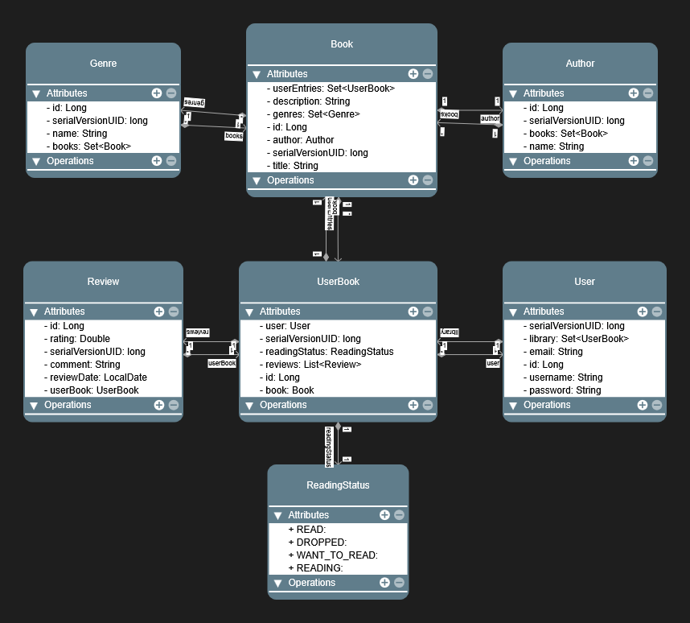

# VLibrary


## 📚 Project Description

VLibrary is a digital library management system that allows users to organize and track their personal book collections, reading progress, and reviews.  
The platform offers a secure, modern REST API built with Java and Spring Boot, following best practices for API design, architecture, and security.

## 🚧 Project Status

**Last Updated:** 2025-07-31 20:34:40 UTC

VLibrary is currently **under active development**.  
The foundational features are implemented and being improved.

### ✅ Main Features

- **User authentication** with JWT-based security
- **User management** (registration, password change, profile)
- **Genre, author, and book management**
- **Integration with Google Books API** for searching and importing books
- **Personal library**: add books, update reading status, remove from library
- **Review system**: users can review and rate books in their library
- **Advanced search and filtering** for books, authors, genres, users, reviews
- **Interactive API documentation** via Swagger/OpenAPI
- **Postman collection** for easy API testing

## 🛣️ Roadmap & Next Steps

- **Centralized API Exception Handling:**  
  Implement a global exception handler to provide consistent and informative error responses for all API endpoints, improving developer experience and maintainability.
- **Enhanced user profile features**
- **Security improvements and refactoring**
- **More detailed error handling and user feedback**

> For details and status of ongoing and planned features, see the [issue tracker](https://github.com/EduardoXDuardo/vlibrary/issues).

---

## 🛠️ Technologies

- Java 24
- Spring Boot 3.5.3
- Spring Security
- JWT Authentication
- Spring Data JPA
- PostgreSQL
- Maven
- Lombok
- SpringDoc OpenAPI / Swagger UI
- Postman

## 🏗️ Project Architecture

VLibrary follows a standard layered architecture pattern:

### Key Components

- **API Layer**: REST controllers for authentication endpoints
- **Service Layer**: Business logic and security implementation
- **Client Layer**: Communicates with external APIs (e.g., Google Books API).
- **Data Layer**: JPA repositories and entity models
- **Entities**: Domain models representing the database structure
- **DTOs**: Data Transfer Objects for request/response/filter data encapsulation
- **Security**: JWT-based authentication and authorization
- **Role-Based Access Control**: Different user roles with specific permissions

The application separates domain entities from API representations using DTOs, ensuring clean data contracts and preventing entity exposure. Spring Security provides authentication with JWT tokens, enabling stateless API access with secure endpoints.

<details>
<summary><b>Architecture Flow</b></summary>

```
                        +-> Clients -> External APIs (Google Books)
                        |                       |
DTOs → Controllers → Services                   |
      ↑                 |                       |      
      |                 +-> Repositories -> Database (Local Data)
      |                                         |
      +-----------------------------------------+
               (Entity to DTO conversion)
```
</details>

<details>
<summary><b>Class Diagram</b></summary>
Below is a UML class diagram representing the main entities and their relationships in the project:



The diagram shows the core entities (`User`, `Book`, `Author`, `Genre`, `UserBook`, `Review`, `ReadingStatus`) and how they are related.
</details>

<details>
<summary><b>Security Implementation Note</b></summary>
The security implementation (authentication and authorization) was developed with the assistance of AI tools. This part of the codebase will be refactored in the future as I enhance my knowledge of Spring Security best practices.
</details>

## 🔑 API Endpoints

### 🔐 Role-Based Access Control

The system uses role-based access control:
- `ROLE_ADMIN`: Can create, edit, and delete authors, genres, books, and users, and assign roles to other users.
- `ROLE_LIBRARIAN`: Can create, edit, and delete authors, genres, and books.
- `ROLE_USER`: Can view and search data, manage their own library and reviews.

When registering a new user, they automatically receive the `ROLE_USER` role. The first admin is created automatically when the system starts (username: `admin`, password: `admin123`).

<details>
<summary><b>🔑 Authentication Endpoints</b></summary>

- `POST /api/auth/register` - Register a new user
- `POST /api/auth/login` - Login and receive JWT token

</details>

<details>
<summary><b>📚 Genre Endpoints</b></summary>

- `POST /api/genres` - Create a new genre
- `GET /api/genres` - Search for genres
  - Supports searching by name, as well as pagination and sorting
  - Example: `GET /api/genres?name=abc&page=0&size=10&sortBy=name&sortDirection=asc`
- `GET /api/genres/{id}` - Get genre by ID
- `PATCH /api/genres/{id}` - Update a genre
- `DELETE /api/genres/{id}` - Delete a genre
  > Note: Deleting a genre will also remove its references from all books associated with it.

</details>

<details>
<summary><b>🖊️ Author Endpoints</b></summary>

- `POST /api/authors` - Create a new author
- `GET /api/authors` - Search for authors
  - Supports searching by name, as well as pagination and sorting
  - Example: `GET /api/authors?name=abc&page=0&size=10&sortBy=name&sortDirection=asc`
- `GET /api/authors/{id}` - Get author by ID
- `PATCH /api/authors/{id}` - Update an author
- `DELETE /api/authors/{id}` - Delete an author
  > Note: An author can only be deleted if it has no books associated with them.

</details>

<details>
<summary><b>📖 Book Endpoints</b></summary>

- `POST /api/books` - Create a new book
- `POST /api/books/external/{apiId}` - Import a book from the Google Books API into the local database using its unique `apiId`. If the book already exists, it is returned; otherwise, it is created.
  - Example: `POST /api/books/import/vxB1mAEACAAJ`
- `GET /api/books` - Search for books
  - Supports searching by title, author, and genre, as well as pagination and sorting
  - Example: `GET /api/books?title=xyz&authorId=123&genreId=456&page=0&size=10&sortBy=title&sortDirection=asc`
- `GET /api/books/external` - Search for books in the Google Books API
  - Supports searching by title, author, publisher, category, ISBN and language.
  - Example: `GET /api/books/external?title=xyz&author=abc&publisher=def&category=ghi&isbn=1234567890`
  - Note: The language parameter seems to be been ignored by the Google Books API, so it may not filter results as expected.
- `GET /api/books/{id}` - Get book by ID
- `PATCH /api/books/{id}` - Update a book
- `DELETE /api/books/{id}` - Delete a book
  > Note: A book can only be deleted if it has no user entries associated with it.

</details>

<details>
<summary><b>👤 User Endpoints</b></summary>

- `GET /api/users/me` - Get the current authenticated user's profile
- `GET /api/users` - Search for users
  - Supports searching by username and email, as well as pagination and sorting
  - Example: `GET /api/users?username=abc&email=def&page=0&size=10&sortBy=username&sortDirection=asc`
- `GET /api/users/{id}` - Get user by ID
- `PATCH /api/users/{id}/password` - Update the current user's password
- `PATCH /api/users/{id}/roles` - Update a user's roles
- `DELETE /api/users/{id}` - Delete a user
  > Note: Deleting a user will also delete all their associated reviews and library entries.

</details>

<details>
<summary><b>📚 Library Endpoints</b></summary>

- `POST /api/library` - Add a book to the user's personal library
- `GET /api/library` - Search the library
  - Supports searching by user, title, author, genre, rating and status, as well as pagination and sorting
  - Example: `GET /api/library?userId=123&bookTitle=abc&authorId=456&genreId=789&rating=2.5&status=read&page=0&size=10&sortBy=id&sortDirection=asc`
  - Note: If no user ID is provided, it defaults to the authenticated user.
- `PATCH /api/library/{userBookId}/reading-status` - Update a book's reading status in the user library
- `DELETE /api/library/{bookId}` - Remove a book from the user's library

</details>

<details>
<summary><b>⭐ Review Endpoints</b></summary>

- `POST /api/library/{userBookId}/reviews` - Create a review for a book in the user's library
  > Only the owner of the library entry can create a review. One review per userBook is allowed.
- `GET /api/reviews` - Search for reviews
  - Supports searching by user, book, comment text (`commentContains`), and rating, as well as pagination and sorting
  - Example: `GET /api/reviews?userId=123&bookId=456&commentContains=abc&rating=4&page=0&size=10&sortBy=id&sortDirection=asc`
  - Note: If no `userId` is provided, it defaults to the authenticated user and only their reviews are shown.
- `GET /api/reviews/{id}` - Get a review by ID
- `PATCH /api/reviews/{id}` - Update a review
- `DELETE /api/reviews/{id}` - Delete a review

</details>

## 📖 API Documentation with Swagger

This project includes interactive API documentation generated with SpringDoc and OpenAPI 3.

Once the application is running, you can access the Swagger UI at:
`http://localhost:8080/swagger-ui/index.html`

### Authorizing Requests in Swagger UI

The Swagger UI is integrated with Spring Security, allowing you to test protected endpoints directly.

1.  First, obtain a JWT token by executing the `POST /api/auth/login` request.
2.  Click the **Authorize** button located at the top right of the Swagger UI page.
3.  In the dialog that appears, paste your token into the `Value` field, making sure to prefix it with `Bearer `. For example: `Bearer eyJhbGciOiJIUzI1NiJ9...`
4.  Click **Authorize** and then **Close**.

After completing these steps, your requests will include the necessary `Authorization` header, and you will be able to interact with all protected endpoints.

## 🧪 API Testing with Postman

This project includes a Postman collection with all the available endpoints for easy testing and exploration.

Click the button below to import the collection into your Postman application:

[](https://www.postman.com/luizdudu35/workspace/public-projects/collection/46291934-d0419c87-4271-4e71-a90a-00ba9b9aa2c3?action=share&source=copy-link&creator=46291934)

### Getting Started with Postman

1.  **Import the Collection:** Click the "Run in Postman" button above.
2.  **Set Up an Environment:** It's recommended to create a Postman Environment and add a variable for your JWT token.
3.  **Authenticate:** Run the `POST /api/auth/login` request first to get a token.
4.  **Use the Token:** Copy the token from the login response and set it as the `Bearer Token` in the "Authorization" tab for the protected requests.

## 📋 Setup Instructions

### Prerequisites
- Java 24 JDK
- PostgreSQL
- Maven

### Configuration
1. Clone the repository
```
git clone https://github.com/EduardoXDuardo/vlibrary.git
```

2. Create your own `application.properties` file in `src/main/resources` by copying the example file:
```
cp src/main/resources/application.properties.example src/main/resources/application.properties
```

3. Edit the `application.properties` file with your specific database credentials and settings. The example file provides the structure you need to follow:
```
# Database Configuration
spring.datasource.url=jdbc:postgresql://localhost:5432/vlibrary
spring.datasource.username=your_username
spring.datasource.password=your_password
spring.jpa.hibernate.ddl-auto=update

# JWT Configuration
app.jwt.secret=your_jwt_secret_key
app.jwt.expiration=86400000
```

4. Build the project
```
mvn clean install
```

5. Run the application
```
mvn spring-boot:run
```

## 🤝 Contributing

Contributions are welcome! If you have suggestions for improvements, bug reports, or want to help implement new features, feel free to open an issue or submit a pull request.

**How to contribute:**
1. Fork the repository.
2. Create a new branch for your feature or fix.
3. Commit your changes with clear messages.
4. Push your branch and open a pull request.
5. Describe your changes and reference any related issues.

Check the [issue tracker](https://github.com/EduardoXDuardo/vlibrary/issues) for things to work on.

Please follow the project's code style and conventions.  
For major changes, open an issue first to discuss what you would like to change.

Thank you for helping make VLibrary better!

## 📄 License
This project is licensed under the MIT License - see the LICENSE file for details.